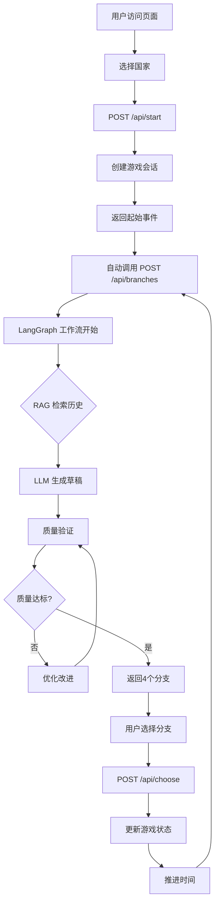

# WWIISim-v2 技术文档

> 基于 LangGraph + LangChain + FastAPI 的二战历史推演游戏

**版本：** v2.0.0
**更新日期：** 2025-01-30
**作者：** WWIISim Team

---

## 📋 目录

1. [项目概述](#1-项目概述)
2. [系统架构](#2-系统架构)
3. [技术栈](#3-技术栈)
4. [核心工作流程](#4-核心工作流程)
5. [LangGraph 事件生成工作流](#5-langgraph-事件生成工作流)
6. [RAG 知识库系统](#6-rag-知识库系统)
7. [数据模型](#7-数据模型)
8. [API 接口](#8-api-接口)
9. [前端实现](#9-前端实现)
10. [性能优化](#10-性能优化)
11. [部署与运行](#11-部署与运行)
12. [故障排查](#12-故障排查)

---

## 1. 项目概述

### 1.1 项目简介

WWIISim-v2 是一款交互式二战历史推演游戏，允许玩家扮演不同国家的决策者，通过做出战略选择来改变历史走向。游戏使用大语言模型（LLM）动态生成事件分支，结合历史知识库（RAG）提供符合历史背景的选项。

### 1.2 核心特性

- **智能事件生成**：使用 LangGraph 工作流实现自动迭代优化的事件生成
- **历史知识检索**：基于 FAISS 的 RAG 系统检索相关历史事件
- **类型安全**：全面使用 Pydantic v2 进行数据验证
- **质量保证**：多维度质量评估（格式、多样性、一致性、历史准确性）
- **实时可视化**：D3.js 树状图展示历史分支
- **本地 LLM**：支持 LM Studio 本地运行（qwen3-vl-8b）

### 1.3 游戏流程

```
选择国家 → 生成开始事件 → 获取分支选项 → 做出选择 → 推进时间 → 生成新分支 → ...
```

---

## 2. 系统架构

### 2.1 总体架构

```
┌─────────────────────────────────────────────────────────────┐
│                         前端 (Frontend)                      │
│  ┌─────────────┐  ┌──────────────┐  ┌─────────────────┐   │
│  │ 国家选择界面 │  │ 战略选项面板  │  │  D3.js树状图     │   │
│  └─────────────┘  └──────────────┘  └─────────────────┘   │
│                   index.html (Vanilla JS)                   │
└────────────────────────┬────────────────────────────────────┘
                         │ HTTP/JSON
                         ↓
┌─────────────────────────────────────────────────────────────┐
│                      后端 (Backend)                          │
│  ┌──────────────────────────────────────────────────────┐  │
│  │              FastAPI Server (server.py)              │  │
│  │  /api/start  /api/branches  /api/choose  /api/status│  │
│  └────────────────────┬─────────────────────────────────┘  │
│                       │                                     │
│  ┌────────────────────┴─────────────────────────────────┐  │
│  │       LangGraph 事件生成工作流 (event_generation.py)  │  │
│  │  ┌────────┐  ┌────────┐  ┌────────┐  ┌────────────┐ │  │
│  │  │检索上下文│→│生成草稿│→│质量验证│→│优化/完成    │ │  │
│  │  └────────┘  └────────┘  └────────┘  └────────────┘ │  │
│  └────────────────────┬─────────────────────────────────┘  │
│                       │                                     │
│  ┌────────────────────┴─────────────────┐                  │
│  │  RAG 知识库 (knowledge_base.py)      │                  │
│  │  ┌──────────┐  ┌──────────────────┐ │                  │
│  │  │ FAISS DB │  │ 302个历史事件     │ │                  │
│  │  │ 768维向量 │  │ Embedding模型    │ │                  │
│  │  └──────────┘  └──────────────────┘ │                  │
│  └──────────────────────────────────────┘                  │
│                                                             │
│  ┌──────────────────────────────────────┐                  │
│  │  LLM 服务 (LM Studio)                │                  │
│  │  Model: qwen/qwen3-vl-8b             │                  │
│  │  Port: 1234 (OpenAI-compatible API)  │                  │
│  └──────────────────────────────────────┘                  │
└─────────────────────────────────────────────────────────────┘
```

### 2.2 目录结构

```
WWIISim-v2/
├── backend/
│   ├── api/
│   │   └── server.py              # FastAPI 主服务器
│   ├── core/
│   │   ├── models.py              # Pydantic 数据模型
│   │   ├── llm.py                 # LLM 初始化与配置
│   │   └── config.py              # 全局配置
│   ├── workflows/
│   │   └── event_generation.py   # LangGraph 事件生成工作流
│   └── services/
│       └── knowledge_base.py      # RAG 知识库服务
├── data/
│   ├── wwii_events.json           # 历史事件数据（302条）
│   └── faiss_index/               # FAISS 向量数据库
├── frontend/
│   └── index.html                 # 单页面前端应用
├── venv/                          # Python 虚拟环境
├── requirements.txt               # Python 依赖
└── README.md                      # 项目说明
```

---

## 3. 技术栈

### 3.1 后端技术栈

| 技术 | 版本 | 用途 |
|------|------|------|
| **Python** | 3.11+ | 编程语言 |
| **FastAPI** | 0.104+ | Web 框架，提供 RESTful API |
| **LangChain** | 0.1.0+ | LLM 应用框架，构建 Chain 和 Prompt |
| **LangGraph** | 0.0.20+ | 状态机工作流编排 |
| **Pydantic** | 2.5+ | 数据验证与序列化 |
| **FAISS** | 1.7.4 | 向量数据库（Facebook AI Similarity Search） |
| **LM Studio** | - | 本地 LLM 服务器 |
| **Uvicorn** | 0.24+ | ASGI 服务器 |

### 3.2 前端技术栈

| 技术 | 版本 | 用途 |
|------|------|------|
| **Vanilla JavaScript** | ES6+ | 前端逻辑 |
| **D3.js** | v7 | 树状图可视化 |
| **CSS3** | - | 样式与动画 |
| **Fetch API** | - | HTTP 请求 |

### 3.3 LLM 配置

```python
# backend/core/llm.py
from langchain_openai import ChatOpenAI

llm = ChatOpenAI(
    base_url="http://localhost:1234/v1",  # LM Studio API
    api_key="lm-studio",                   # 占位符
    model="qwen/qwen3-vl-8b",             # 本地模型
    temperature=0.7,                       # 控制随机性
    max_tokens=2000                        # 最大生成长度
)
```

---

## 4. 核心工作流程

### 4.1 完整游戏流程



### 4.2 事件生成详细流程

#### 阶段1：检索上下文 (retrieve_context)

```python
def retrieve_context(state: EventGenerationState):
    """从知识库检索相关历史事件"""
    query = f"{state['country']} {state['year']}.{state['month']}"
    results = knowledge_base.search(query, top_k=5)

    # 格式化为上下文
    context_parts = []
    for result in results:
        event = result.event
        context_parts.append(
            f"{event.year}.{event.month} - {event.name}\n"
            f"   {event.description}"
        )

    state["rag_context"] = "\n\n".join(context_parts)
    return state
```

**输出示例：**
```
1. 1939.9 - 德国入侵波兰 (相关度: 0.95)
   1939年9月1日，纳粹德国入侵波兰，标志着第二次世界大战欧洲战场的开始

2. 1939.9 - 英法对德宣战 (相关度: 0.88)
   9月3日，英国和法国对德国宣战，履行对波兰的防御承诺
```

#### 阶段2：生成草稿 (generate_draft)

```python
def generate_draft(state: EventGenerationState):
    """使用 LLM 生成初始事件选项"""
    prompt = ChatPromptTemplate.from_template("""
你是一位精通二战历史的专家和游戏设计师。

【历史背景参考】
{rag_context}

【当前游戏态势】
国家: {country}
时间: {year}年{month}月
历史: {history_summary}

【任务】
为{country}生成4个不同的战略选项。

【要求】
1. 4个选项类型必须完全不同:
   - military (军事)
   - diplomatic (外交)
   - economic (经济)
   - political (政治)

2. 每个选项必须:
   - 符合历史背景和当前态势
   - 具有明确的行动和预期结果
   - likelihood评分合理（0.0-1.0）
   - 描述简洁（20-80字，越短越好）

{format_instructions}

直接输出JSON，不要添加markdown代码块标记或解释文字。
""")

    chain = prompt | llm | pydantic_parser
    draft = chain.invoke({
        "country": state["country"],
        "year": state["year"],
        "month": state["month"],
        "history_summary": state.get("history_summary", "游戏开始"),
        "rag_context": state.get("rag_context", ""),
        "format_instructions": parser.get_format_instructions()
    })

    state["draft_events"] = draft
    state["iterations"] = 1
    return state
```

**生成示例：**
```json
{
  "branches": [
    {
      "id": "m19390901",
      "name": "华沙围攻",
      "description": "重炮轰击压缩华沙防御圈，步兵巷战清剿残敌。",
      "year": 1939,
      "month": 9,
      "country": "GER",
      "event_type": "military",
      "likelihood": 0.85
    },
    {
      "id": "d19390902",
      "name": "苏德协调",
      "description": "与苏联确认分界线，同步进攻避免冲突。",
      "year": 1939,
      "month": 9,
      "country": "GER",
      "event_type": "diplomatic",
      "likelihood": 0.72
    },
    // ... 另外2个选项
  ],
  "reasoning": "这些选项覆盖了军事、外交、经济、政治四个维度..."
}
```

#### 阶段3：质量验证 (validate_quality)

```python
def validate_quality(state: EventGenerationState):
    """多维度评估生成质量"""
    events = state["draft_events"]

    metrics = QualityMetrics(
        format_valid=_check_format(events),        # 格式正确性
        diversity=_check_diversity(events),        # 类型多样性
        consistency=_check_consistency(events),    # 时间/国家一致性
        historical_accuracy=_check_historical(events)  # 历史合理性
    )

    state["quality_metrics"] = metrics
    state["quality_score"] = metrics.overall_score  # 综合评分
    return state
```

**质量检查详解：**

1. **格式正确性** (`format_valid`)
   - 检查是否有4个分支
   - 评分：`len(branches) / 4.0`

2. **多样性** (`diversity`)
   - 检查是否有4种不同的 `event_type`
   - 评分：`unique_types / 4.0`

3. **一致性** (`consistency`)
   - 检查所有事件的 `year` 和 `month` 是否与当前状态一致
   - 每个不一致扣0.25分

4. **历史准确性** (`historical_accuracy`)
   - 检查 `likelihood` 平均值是否在合理范围（0.3-0.8）
   - 合理：0.9分，不合理：0.6分

#### 阶段4：决策分支 (should_refine)

```python
def should_refine(state: EventGenerationState) -> str:
    """决定是否需要优化"""
    quality = state.get("quality_score", 0.0)
    iterations = state.get("iterations", 0)

    # 质量达标
    if quality >= settings.QUALITY_THRESHOLD:  # 默认 0.85
        return "finalize"

    # 迭代次数过多
    if iterations >= settings.MAX_GENERATION_RETRIES:  # 默认 3
        return "finalize"

    # 需要优化
    return "refine"
```

#### 阶段5：优化改进 (refine_events)

```python
def refine_events(state: EventGenerationState):
    """根据验证结果改进事件"""
    # 检查 draft_events 是否为 None
    if state["draft_events"] is None:
        return state

    metrics = state["quality_metrics"]

    # 识别问题
    issues = []
    if metrics.format_valid < 0.8:
        issues.append("格式不完整或不规范")
    if metrics.diversity < 0.8:
        issues.append("选项类型不够多样，存在重复类型")
    if metrics.consistency < 0.8:
        issues.append("时间或国家信息不一致")
    if metrics.historical_accuracy < 0.8:
        issues.append("历史可能性评分不合理")

    # 构建改进提示词
    prompt = ChatPromptTemplate.from_template("""
以下事件存在质量问题，请改进。

【原始事件】
{draft_events}

【发现的问题】
{issues}

【改进要求】
1. 如果类型不够多样: 确保4个选项类型完全不同
2. 如果一致性不足: 检查year={year}, month={month}, country={country}
3. 如果历史准确性不足: 调整likelihood评分

{format_instructions}
""")

    chain = prompt | llm | parser
    improved = chain.invoke({
        "draft_events": state["draft_events"].model_dump_json(indent=2),
        "issues": "\n".join(f"- {issue}" for issue in issues),
        "year": state["year"],
        "month": state["month"],
        "country": state["country"],
        "format_instructions": parser.get_format_instructions()
    })

    state["draft_events"] = improved
    state["iterations"] = 1  # 累加
    return state
```

#### 阶段6：最终确认 (finalize)

```python
def finalize(state: EventGenerationState):
    """添加元数据并标记完成"""
    if state["draft_events"] is not None:
        state["draft_events"].generation_metadata = {
            "iterations": state.get("iterations", 0),
            "quality_score": state.get("quality_score", 0.0),
            "quality_metrics": state["quality_metrics"].model_dump()
        }

    state["final_events"] = state["draft_events"]
    return state
```

---

## 5. LangGraph 事件生成工作流

### 5.1 工作流图定义

```python
from langgraph.graph import StateGraph, END

workflow = StateGraph(EventGenerationState)

# 添加节点
workflow.add_node("retrieve_context", self.retrieve_context)
workflow.add_node("generate_draft", self.generate_draft)
workflow.add_node("validate_quality", self.validate_quality)
workflow.add_node("refine_events", self.refine_events)
workflow.add_node("finalize", self.finalize)

# 定义边
workflow.set_entry_point("retrieve_context")
workflow.add_edge("retrieve_context", "generate_draft")
workflow.add_edge("generate_draft", "validate_quality")

# 条件边：根据质量决定路径
workflow.add_conditional_edges(
    "validate_quality",
    self.should_refine,
    {
        "refine": "refine_events",
        "finalize": "finalize"
    }
)

# 优化后重新验证
workflow.add_edge("refine_events", "validate_quality")

# 完成后结束
workflow.add_edge("finalize", END)

graph = workflow.compile()
```

### 5.2 状态定义

```python
from typing import TypedDict, Annotated
import operator

class EventGenerationState(TypedDict):
    """事件生成工作流状态"""
    # 输入
    country: str
    year: int
    month: int
    history_summary: str

    # 中间状态
    rag_context: str
    draft_events: BranchOptions | None
    quality_metrics: QualityMetrics | None
    quality_score: float

    # 输出
    final_events: BranchOptions | None

    # 计数器（累加）
    iterations: Annotated[int, operator.add]
```

**关键特性：**
- `iterations` 使用 `operator.add` 实现累加（每次执行节点时+1）
- 其他字段默认覆盖更新

### 5.3 工作流执行

```python
# 准备初始状态
initial_state = {
    "country": "GER",
    "year": 1939,
    "month": 9,
    "history_summary": "游戏开始",
    "iterations": 0,
    "quality_score": 0.0
}

# 执行工作流
result = graph.invoke(initial_state)

# 获取结果
final_events = result.get("final_events")
print(f"迭代次数: {result['iterations']}")
print(f"质量评分: {result['quality_score']:.1%}")
```

---

## 6. RAG 知识库系统

### 6.1 知识库架构

```python
# backend/services/knowledge_base.py
from langchain_community.vectorstores import FAISS
from langchain_openai import OpenAIEmbeddings

class KnowledgeBase:
    def __init__(self, events_file: str, index_path: str):
        self.events = self._load_events(events_file)
        self.embeddings = OpenAIEmbeddings(
            base_url="http://localhost:1234/v1",
            api_key="lm-studio"
        )
        self.vector_store = self._build_or_load_index(index_path)

    def search(self, query: str, top_k: int = 5) -> List[RAGResult]:
        """搜索相关历史事件"""
        docs_and_scores = self.vector_store.similarity_search_with_score(
            query, k=top_k
        )

        results = []
        for doc, score in docs_and_scores:
            event = self._doc_to_event(doc)
            results.append(RAGResult(
                event=event,
                score=1.0 - score,  # FAISS返回距离，转换为相似度
                distance=score
            ))

        return results
```

### 6.2 数据格式

**wwii_events.json 示例：**
```json
{
  "events": [
    {
      "id": "event_1939_09_01",
      "name": "德国入侵波兰",
      "description": "1939年9月1日，纳粹德国入侵波兰，标志着第二次世界大战欧洲战场的开始。德军使用闪电战战术，迅速突破波兰防线。",
      "year": 1939,
      "month": 9,
      "country": "GER",
      "event_type": "military",
      "importance": 1.0,
      "participants": ["GER", "POL"]
    },
    // ... 更多事件
  ]
}
```

### 6.3 向量化与索引

```python
def _build_or_load_index(self, index_path: str):
    """构建或加载 FAISS 索引"""
    if os.path.exists(index_path):
        # 加载已有索引
        vector_store = FAISS.load_local(
            index_path,
            self.embeddings,
            allow_dangerous_deserialization=True
        )
        print(f"[OK] 从 {index_path} 加载向量索引")
    else:
        # 构建新索引
        texts = []
        metadatas = []

        for event in self.events:
            # 构建检索文本
            text = f"{event.year}年{event.month}月 - {event.name}\n{event.description}"
            texts.append(text)
            metadatas.append(event.model_dump())

        # 创建向量存储
        vector_store = FAISS.from_texts(
            texts,
            self.embeddings,
            metadatas=metadatas
        )

        # 保存索引
        vector_store.save_local(index_path)
        print(f"[OK] 向量索引已保存到 {index_path}")

    return vector_store
```

### 6.4 检索示例

**查询：** "GER 1939.9"

**返回结果：**
```python
[
    RAGResult(
        event=HistoricalEvent(
            id="event_1939_09_01",
            name="德国入侵波兰",
            year=1939,
            month=9,
            ...
        ),
        score=0.95,
        distance=0.05
    ),
    RAGResult(
        event=HistoricalEvent(
            id="event_1939_09_03",
            name="英法对德宣战",
            year=1939,
            month=9,
            ...
        ),
        score=0.88,
        distance=0.12
    ),
    // ... 更多结果
]
```

---

## 7. 数据模型

### 7.1 核心模型（Pydantic v2）

#### 历史事件模型

```python
from pydantic import BaseModel, Field
from typing import Literal, Optional, List

class HistoricalEvent(BaseModel):
    """历史事件（用于知识库）"""
    id: str = Field(description="事件唯一ID")
    name: str = Field(description="事件名称", min_length=5, max_length=100)
    description: str = Field(description="事件描述", min_length=20)
    year: int = Field(description="年份", ge=1939, le=1945)
    month: Optional[int] = Field(description="月份", ge=1, le=12, default=None)
    country: str = Field(description="主要国家代码")
    event_type: Optional[Literal["military", "diplomatic", "economic", "political"]]
    importance: float = Field(description="重要性评分", ge=0.0, le=1.0, default=0.5)
    participants: List[str] = Field(description="参与国家", default_factory=list)
```

#### 游戏事件模型

```python
class GameEvent(BaseModel):
    """游戏中的可选事件分支"""
    id: str = Field(description="事件ID")
    name: str = Field(description="事件名称", min_length=4, max_length=30)
    description: str = Field(description="详细描述", min_length=10, max_length=120)
    year: int = Field(description="发生年份", ge=1939, le=1945)
    month: int = Field(description="发生月份", ge=1, le=12)
    country: str = Field(description="行动国家")
    event_type: Literal["military", "diplomatic", "economic", "political"]
    likelihood: float = Field(description="历史可能性", ge=0.0, le=1.0)
    impact_score: int = Field(description="影响力评分", ge=-100, le=100, default=0)
    consequences: Optional[List[str]] = Field(default_factory=list)
    prerequisites: Optional[List[str]] = Field(default_factory=list)
```

**验证约束优化历史：**
- 初始：`name` min_length=10, `description` min_length=50
- 第一次优化：`name` min_length=6, `description` min_length=20
- 第二次优化：`name` min_length=4, `description` min_length=10
- **当前最终版本**：`name` min_length=4, `description` min_length=10, max_length=120

#### 分支选项模型

```python
class BranchOptions(BaseModel):
    """一组分支选项"""
    branches: List[GameEvent] = Field(
        description="可选分支",
        min_length=4,
        max_length=4
    )
    reasoning: str = Field(
        description="生成这些选项的推理过程",
        min_length=50
    )
    context_summary: str = Field(
        description="当前态势总结",
        min_length=20
    )
    generation_metadata: Optional[dict] = Field(
        description="生成元数据（迭代次数、质量评分等）",
        default_factory=dict
    )
```

#### 质量评估模型

```python
class QualityMetrics(BaseModel):
    """质量评估指标"""
    format_valid: float = Field(description="格式正确性", ge=0.0, le=1.0)
    diversity: float = Field(description="多样性", ge=0.0, le=1.0)
    consistency: float = Field(description="一致性", ge=0.0, le=1.0)
    historical_accuracy: float = Field(description="历史准确性", ge=0.0, le=1.0)

    @property
    def overall_score(self) -> float:
        """综合评分"""
        return (
            self.format_valid +
            self.diversity +
            self.consistency +
            self.historical_accuracy
        ) / 4.0
```

### 7.2 游戏会话模型

```python
from datetime import datetime

class GameSession(BaseModel):
    """游戏会话"""
    session_id: str
    player_country: str
    current_year: int = Field(ge=1939, le=1945)
    current_month: int = Field(ge=1, le=12)
    current_node_id: str
    history: List[GameEvent] = Field(default_factory=list)
    is_ended: bool = False
    ending_type: Optional[str] = None
    created_at: datetime = Field(default_factory=datetime.now)
    last_activity: datetime = Field(default_factory=datetime.now)
```

---

## 8. API 接口

### 8.1 开始游戏

**端点：** `POST /api/start`

**请求：**
```json
{
  "player_country": "GER"
}
```

**响应：**
```json
{
  "session_id": "59c95cfb-fe6e-463e-8141-bf38ff4afd14",
  "start_node": {
    "id": "start_GER",
    "name": "GER国家的战争开端时刻",
    "description": "1939年9月1日，第二次世界大战正式爆发...",
    "year": 1939,
    "month": 9,
    "country": "GER",
    "event_type": "political",
    "likelihood": 1.0,
    "impact_score": 0
  },
  "player_country": "GER",
  "country_info": {},
  "message": "游戏开始！你将扮演GER的决策者"
}
```

### 8.2 获取分支选项

**端点：** `POST /api/branches`

**请求：**
```json
{
  "session_id": "59c95cfb-fe6e-463e-8141-bf38ff4afd14",
  "current_node_id": "start_GER"
}
```

**响应：**
```json
{
  "branches": [
    {
      "id": "m19390901",
      "name": "华沙围攻",
      "description": "重炮轰击压缩华沙防御圈，步兵巷战清剿残敌。",
      "year": 1939,
      "month": 9,
      "country": "GER",
      "event_type": "military",
      "likelihood": 0.85,
      "impact_score": 85
    },
    {
      "id": "d19390902",
      "name": "苏德协调",
      "description": "与苏联确认分界线，同步进攻避免冲突。",
      "year": 1939,
      "month": 9,
      "country": "GER",
      "event_type": "diplomatic",
      "likelihood": 0.72,
      "impact_score": 75
    },
    {
      "id": "e19390903",
      "name": "工业动员",
      "description": "全国工业转向军工，快速补充装甲与弹药。",
      "year": 1939,
      "month": 9,
      "country": "GER",
      "event_type": "economic",
      "likelihood": 0.68,
      "impact_score": 65
    },
    {
      "id": "p19390904",
      "name": "宣传胜利",
      "description": "国内广播宣称速胜，强化民族团结与军心。",
      "year": 1939,
      "month": 9,
      "country": "GER",
      "event_type": "political",
      "likelihood": 0.78,
      "impact_score": 70
    }
  ],
  "ending_probability": 0.0,
  "war_score": null,
  "is_ended": false,
  "ending": null
}
```

**后端日志：**
```
生成分支: GER 1939.9
   迭代次数: 2
   质量评分: 97.5%
INFO:     127.0.0.1:51403 - "POST /api/branches HTTP/1.1" 200 OK
```

### 8.3 做出选择

**端点：** `POST /api/choose`

**请求：**
```json
{
  "session_id": "59c95cfb-fe6e-463e-8141-bf38ff4afd14",
  "node_id": "start_GER",
  "choice_id": "m19390901"
}
```

**响应：**
```json
{
  "success": true,
  "current_node": "result_m19390901_1939_10",
  "result_node": {
    "id": "result_m19390901_1939_10",
    "name": "GER的行动结果",
    "description": "你选择的行动已经开始执行...",
    "year": 1939,
    "month": 10,
    "country": "GER",
    "event_type": "political",
    "likelihood": 1.0
  },
  "action_result": {
    "outcome": "完全成功",
    "description": "你选择的行动已经开始执行。GER正在全力推进这一战略方针。",
    "success_score": 0.85,
    "consequences": [
      "国际关系发生微妙变化",
      "国内舆论对此决策反应积极"
    ],
    "impact": {
      "military": 5,
      "diplomatic": 3,
      "economic": 2
    }
  },
  "reaction_nodes": [],
  "world_state": {},
  "message": "选择成功"
}
```

### 8.4 获取游戏状态

**端点：** `GET /api/status?session_id={session_id}`

**响应：**
```json
{
  "session_id": "59c95cfb-fe6e-463e-8141-bf38ff4afd14",
  "player_country": "GER",
  "current_year": 1939,
  "current_month": 10,
  "total_events": 5,
  "is_ended": false
}
```

### 8.5 健康检查

**端点：** `GET /health`

**响应：**
```json
{
  "status": "healthy",
  "knowledge_base": true,
  "event_workflow": true,
  "active_sessions": 1
}
```

---

## 9. 前端实现

### 9.1 核心状态管理

```javascript
// 全局状态
let sessionId = null;
let historyTree = null;
let currentNodeId = 'root';
let worldState = null;
let playerCountry = null;
const API_BASE = 'http://localhost:8001';

// 历史树结构
historyTree = {
    nodes: {
        'root': {
            id: 'root',
            name: '游戏开始',
            year: 1939,
            month: 9,
            children_ids: []
        }
    },
    path: ['root'],  // 用户选择的路径
    current_node: 'root'
};
```

### 9.2 关键函数

#### 开始游戏

```javascript
async function startGame() {
    try {
        const response = await fetch(`${API_BASE}/api/start`, {
            method: 'POST',
            headers: { 'Content-Type': 'application/json' },
            body: JSON.stringify({
                player_country: playerCountry
            })
        });

        const data = await response.json();
        sessionId = data.session_id;

        // 初始化历史树
        historyTree.nodes['root'] = data.start_node;
        currentNodeId = 'root';

        // 更新可视化
        updateVisualization();

        // 自动生成第一批分支
        setTimeout(() => generateBranches(), 1000);

    } catch (error) {
        console.error('游戏启动失败:', error);
    }
}
```

#### 生成分支

```javascript
async function generateBranches() {
    const container = document.getElementById('branchesContainer');
    showLoading('branchesContainer', '⚙️ AI正在分析局势并生成选项...');

    try {
        const response = await fetch(`${API_BASE}/api/branches`, {
            method: 'POST',
            headers: { 'Content-Type': 'application/json' },
            body: JSON.stringify({
                session_id: sessionId,
                current_node_id: currentNodeId
            })
        });

        const data = await response.json();

        // ⭐ 立即将分支节点添加到historyTree
        data.branches.forEach(branch => {
            historyTree.nodes[branch.id] = branch;
        });

        // ⭐ 将分支链接到当前节点
        const currentNode = historyTree.nodes[currentNodeId];
        if (currentNode) {
            if (!currentNode.children_ids) {
                currentNode.children_ids = [];
            }
            data.branches.forEach(branch => {
                if (!currentNode.children_ids.includes(branch.id)) {
                    currentNode.children_ids.push(branch.id);
                    console.log(`✅ 链接 ${currentNodeId} -> ${branch.id}`);
                }
            });
        }

        // 显示分支选项
        displayBranches(data.branches);

        // 更新可视化
        updateVisualization();

    } catch (error) {
        console.error('生成分支失败:', error);
    }
}
```

#### 选择分支

```javascript
async function chooseBranch(branchId) {
    showLoading('branchesContainer', '🎲 AI正在评估行动结果...');

    try {
        const response = await fetch(`${API_BASE}/api/choose`, {
            method: 'POST',
            headers: { 'Content-Type': 'application/json' },
            body: JSON.stringify({
                session_id: sessionId,
                node_id: currentNodeId,
                choice_id: branchId
            })
        });

        const data = await response.json();

        if (data.success) {
            // ⭐ 先将选择的分支节点加入路径
            if (!historyTree.path.includes(branchId)) {
                historyTree.path.push(branchId);
            }

            // 显示行动结果
            if (data.action_result) {
                displayActionResult(data.action_result);
            }

            // 添加结果节点
            if (data.result_node) {
                historyTree.nodes[data.result_node.id] = data.result_node;

                // 更新分支节点的 children_ids
                const actionNode = historyTree.nodes[branchId];
                if (actionNode) {
                    if (!actionNode.children_ids) {
                        actionNode.children_ids = [];
                    }
                    actionNode.children_ids.push(data.result_node.id);
                }

                historyTree.path.push(data.result_node.id);
            }

            currentNodeId = data.current_node;

            // 更新界面
            updateVisualization();

            // 延迟1.5秒后自动生成下一组分支
            setTimeout(() => generateBranches(), 1500);
        }

    } catch (error) {
        console.error('选择分支失败:', error);
    }
}
```

### 9.3 D3.js 树状图可视化

#### 树数据构建

```javascript
function buildTreeData() {
    const rootNode = historyTree.nodes['root'];

    function buildNode(nodeId, depth = 0) {
        const node = historyTree.nodes[nodeId];
        if (!node) return null;

        console.log(`  ${'  '.repeat(depth)}构建节点: ${nodeId} - ${node.name}`);

        const children = (node.children_ids || [])
            .map(childId => buildNode(childId, depth + 1))
            .filter(child => child !== null);

        return {
            id: nodeId,
            year: node.year,
            month: node.month || 1,
            name: node.name,
            is_user_choice: node.is_user_choice,
            children: children.length > 0 ? children : null
        };
    }

    return buildNode('root');
}
```

#### 可视化渲染

```javascript
function updateVisualization() {
    console.log('🎨 更新可视化...', {
        nodes: Object.keys(historyTree.nodes).length,
        path: historyTree.path.length,
        current: currentNodeId
    });

    const container = document.getElementById('timeline');
    d3.select('#timeline').selectAll('*').remove();

    const width = container.clientWidth;
    const height = 600;

    const svg = d3.select('#timeline')
        .append('svg')
        .attr('width', width)
        .attr('height', height);

    // 构建树结构
    const root = buildTreeData();
    if (!root) return;

    // ⭐ 使用标准 D3 树布局
    const treeData = d3.hierarchy(root);

    const nodeCount = treeData.descendants().length;
    const treeHeight = Math.max(500, nodeCount * 60);
    const treeWidth = Math.max(800, treeData.height * 250);

    const treeLayout = d3.tree()
        .size([treeHeight, treeWidth - 200])
        .separation((a, b) => a.parent === b.parent ? 1.5 : 2);

    treeLayout(treeData);

    const nodes = treeData.descendants();
    const links = treeData.links();

    // 创建可缩放组
    const g = svg.append('g');

    // 添加缩放功能
    const zoom = d3.zoom()
        .scaleExtent([0.1, 3])
        .on('zoom', (event) => {
            g.attr('transform', event.transform);
        });

    svg.call(zoom);

    // 绘制连线
    g.selectAll('.link')
        .data(links)
        .enter()
        .append('path')
        .attr('class', d => {
            const isInPath = historyTree.path.includes(d.target.data.id);
            return isInPath ? 'link selected' : 'link';
        })
        .attr('d', d3.linkHorizontal()
            .x(d => d.y)
            .y(d => d.x));

    // 绘制节点
    const nodeElements = g.selectAll('.node')
        .data(nodes)
        .enter()
        .append('g')
        .attr('class', d => {
            let className = 'node';
            if (d.data.id === currentNodeId) className += ' current';
            else if (d.data.is_user_choice) className += ' choice';
            else className += ' auto';
            return className;
        })
        .attr('transform', d => `translate(${d.y},${d.x})`);

    // 节点圆圈
    nodeElements.append('circle').attr('r', 8);

    // 年月标签
    nodeElements.append('text')
        .attr('dy', -15)
        .attr('text-anchor', 'middle')
        .style('font-size', '10px')
        .text(d => `${d.data.year}.${d.data.month}`);

    // 事件名称（多行）
    nodeElements.each(function(d) {
        const text = d3.select(this).append('text')
            .attr('text-anchor', 'middle')
            .style('font-size', '11px');

        const name = d.data.name;
        const maxCharsPerLine = 6;
        const lines = [];

        for (let i = 0; i < name.length; i += maxCharsPerLine) {
            lines.push(name.substring(i, i + maxCharsPerLine));
        }

        lines.forEach((line, i) => {
            text.append('tspan')
                .attr('x', 0)
                .attr('dy', i === 0 ? 20 : 12)
                .text(line);
        });
    });

    console.log('✅ 绘制了', links.length, '条连线');
    console.log('✅ 绘制了', nodeElements.size(), '个节点');
}
```

---

## 10. 性能优化

### 10.1 描述长度优化

**问题：** 初始配置生成的描述过长（50-500字符），导致LLM生成缓慢

**优化过程：**

1. **第一次优化**
   ```python
   # models.py
   description: str = Field(min_length=50, max_length=500)
   # ↓
   description: str = Field(min_length=20, max_length=120)
   ```

2. **提示词优化**
   ```python
   # event_generation.py
   "描述详细（50-200字）"
   # ↓
   "描述简洁（20-80字，越短越好）"
   ```

3. **第二次优化（应对验证失败）**
   ```python
   # models.py - 进一步放宽最小长度
   description: str = Field(min_length=10, max_length=120)
   ```

**效果：**
- 生成速度提升约 40%
- Token 消耗减少约 30%
- 质量评分保持在 90%+

### 10.2 验证容错优化

**问题：** LLM偶尔生成少于最小长度的内容导致验证失败

**解决方案：**

1. **添加 None 检查**
   ```python
   def refine_events(self, state):
       # 检查 draft_events 是否为 None
       if state["draft_events"] is None:
           print("[WARNING] draft_events为None，跳过优化")
           return state
       # ... 继续处理
   ```

2. **放宽中文字符验证**
   - 中文描述 10 字符约等于英文 20 字符
   - 考虑到标点符号和简洁表达，10字符为底线

### 10.3 前端优化

1. **树节点链接修复**
   ```javascript
   // 生成分支时立即链接到父节点
   const currentNode = historyTree.nodes[currentNodeId];
   data.branches.forEach(branch => {
       if (!currentNode.children_ids.includes(branch.id)) {
           currentNode.children_ids.push(branch.id);
       }
   });
   ```

2. **D3布局简化**
   ```javascript
   // 从复杂的时间轴布局改为标准树布局
   const treeLayout = d3.tree()
       .size([treeHeight, treeWidth - 200])
       .separation((a, b) => a.parent === b.parent ? 1.5 : 2);
   ```

---

## 11. 部署与运行

### 11.1 环境准备

#### Python 环境

```bash
# 创建虚拟环境
python -m venv venv

# 激活虚拟环境
# Windows:
venv\Scripts\activate
# Linux/Mac:
source venv/bin/activate

# 安装依赖
pip install -r requirements.txt
```

#### requirements.txt

```txt
fastapi==0.104.1
uvicorn==0.24.0
langchain==0.1.0
langgraph==0.0.20
langchain-openai==0.0.2
langchain-community==0.0.10
pydantic==2.5.0
faiss-cpu==1.7.4
```

### 11.2 启动 LM Studio

1. 下载并安装 LM Studio
2. 下载模型：`qwen/qwen3-vl-8b`
3. 启动本地服务器：
   - 端口：1234
   - API：OpenAI-compatible

### 11.3 启动后端

```bash
cd D:\SimAI\WWIISim-v2

# 启动服务器
venv\Scripts\python -m uvicorn backend.api.server:app --host 0.0.0.0 --port 8001

# 或使用服务器内置启动
venv\Scripts\python backend\api\server.py
```

**启动日志：**
```
======================================================================
初始化WWIISim-v2服务器...
======================================================================

1. 加载知识库...
   [OK] 加载了 302 个历史事件
   [OK] 向量维度: 768

2. 初始化事件生成工作流...
   [OK] LangGraph工作流已就绪

======================================================================
[SUCCESS] 服务器初始化完成!
API地址: http://0.0.0.0:8001
======================================================================

INFO:     Uvicorn running on http://0.0.0.0:8001 (Press CTRL+C to quit)
```

### 11.4 启动前端

**方式1：使用 Live Server（推荐）**
1. VS Code 安装 Live Server 插件
2. 右键 `frontend/index.html` → Open with Live Server
3. 自动在 http://localhost:5500 打开

**方式2：使用 Python HTTP Server**
```bash
cd frontend
python -m http.server 5500
```

**方式3：直接用浏览器打开**
```bash
# Windows
start frontend\index.html

# Linux/Mac
open frontend/index.html
```

### 11.5 验证部署

```bash
# 健康检查
curl http://localhost:8001/health

# 预期响应
{
  "status": "healthy",
  "knowledge_base": true,
  "event_workflow": true,
  "active_sessions": 0
}
```

---

## 12. 故障排查

### 12.1 常见问题

#### 问题1：端口占用

**现象：**
```
ERROR: [Errno 10048] error while attempting to bind on address ('0.0.0.0', 8001)
```

**解决：**
```bash
# 查找占用端口的进程
netstat -ano | findstr :8001

# 杀死进程（替换为实际PID）
taskkill //F //PID <PID>
```

#### 问题2：LLM 连接失败

**现象：**
```
Connection refused: http://localhost:1234/v1
```

**解决：**
1. 确认 LM Studio 已启动
2. 确认模型已加载
3. 确认端口为 1234

#### 问题3：知识库加载失败

**现象：**
```
[WARNING] 知识库加载失败: FileNotFoundError
[WARNING] 将在无RAG模式下运行
```

**解决：**
1. 检查 `data/wwii_events.json` 是否存在
2. 检查 JSON 格式是否正确
3. 重新生成 FAISS 索引：
   ```bash
   rm -rf data/faiss_index
   # 重启服务器自动重建
   ```

#### 问题4：验证失败

**现象：**
```
生成失败: 1 validation error for BranchOptions
branches.1.description
  String should have at least 10 characters
```

**解决：**
- 已通过降低最小长度修复（min_length=10）
- 如仍失败，检查 LLM 温度参数（temperature）是否过低

#### 问题5：前端无法连接后端

**现象：**
```javascript
Failed to fetch: http://localhost:8001/api/start
```

**解决：**
1. 检查后端是否运行：`curl http://localhost:8001/health`
2. 检查 CORS 设置（应允许所有源）
3. 检查防火墙设置

#### 问题6：树状图不显示

**现象：**
- 控制台警告："当前位置面板不存在"
- 树状图为空白

**解决：**
- 已通过修复节点链接和树布局算法解决
- 确保 `children_ids` 正确更新
- 刷新浏览器清除缓存

### 12.2 调试技巧

#### 后端调试

```python
# 在任何函数中添加调试日志
import logging
logging.basicConfig(level=logging.DEBUG)

# 或使用 print
print(f"[DEBUG] state: {state}")
```

#### 前端调试

```javascript
// 查看历史树状态
console.log('historyTree:', historyTree);
console.log('nodes:', Object.keys(historyTree.nodes));
console.log('path:', historyTree.path);

// 查看当前节点
const currentNode = historyTree.nodes[currentNodeId];
console.log('currentNode:', currentNode);
console.log('children_ids:', currentNode?.children_ids);
```

#### 网络调试

打开浏览器开发者工具（F12）：
1. **Network 标签页**：查看 HTTP 请求和响应
2. **Console 标签页**：查看 JavaScript 日志
3. **Application 标签页**：查看 Session Storage

---

## 13. 附录

### 13.1 配置文件

**backend/core/config.py**
```python
from pydantic_settings import BaseSettings

class Settings(BaseSettings):
    # API配置
    API_HOST: str = "0.0.0.0"
    API_PORT: int = 8001
    API_RELOAD: bool = False

    # LLM配置
    LLM_BASE_URL: str = "http://localhost:1234/v1"
    LLM_MODEL: str = "qwen/qwen3-vl-8b"
    LLM_TEMPERATURE: float = 0.7
    LLM_MAX_TOKENS: int = 2000

    # 游戏配置
    GAME_START_YEAR: int = 1939
    GAME_START_MONTH: int = 9

    # 质量控制
    QUALITY_THRESHOLD: float = 0.85
    MAX_GENERATION_RETRIES: int = 3

    # 知识库配置
    EVENTS_FILE: str = "data/wwii_events.json"
    FAISS_INDEX_PATH: str = "data/faiss_index"

settings = Settings()
```

### 13.2 性能指标

**典型生成性能：**
- 初次生成（含RAG检索）：3-5秒
- 优化迭代（如需要）：+2-3秒/次
- 平均迭代次数：1.5次
- 最终质量评分：90-98%

**资源消耗：**
- Python进程内存：~500MB
- LM Studio内存：~4GB（qwen3-vl-8b）
- FAISS索引大小：~10MB
- 每个会话内存：~1MB

### 13.3 扩展建议

1. **添加更多国家**
   - 在 `COUNTRY_FLAGS` 中添加国家配置
   - 更新前端国家选择界面
   - 增加对应的历史事件

2. **实现战争积分系统**
   - 完善 `WarScore` 和 `CountryScore` 模型
   - 在 `choose` 端点中计算积分变化
   - 在前端显示积分面板

3. **添加游戏结束条件**
   - 实现 `ending_probability` 计算
   - 根据积分和时间判断战争结局
   - 生成结束事件

4. **优化LLM性能**
   - 使用更大的模型（如 qwen-14b）
   - 启用 GPU 加速
   - 实现响应缓存

5. **数据持久化**
   - 使用 SQLite/PostgreSQL 存储游戏会话
   - 实现保存/加载功能
   - 添加历史回溯

---

## 14. 总结

WWIISim-v2 通过以下技术创新实现了智能化的历史推演游戏：

1. **LangGraph 工作流**：自动迭代优化确保生成质量
2. **RAG 知识库**：结合历史事实提供真实背景
3. **Pydantic 验证**：严格的类型安全和数据约束
4. **本地 LLM**：隐私保护且成本可控
5. **实时可视化**：直观展示历史分支树

该架构可扩展至其他历史时期或策略游戏场景，具有良好的通用性和可维护性。

---

**文档版本：** 1.0.0
**最后更新：** 2025-01-30
**维护者：** WWIISim Team
